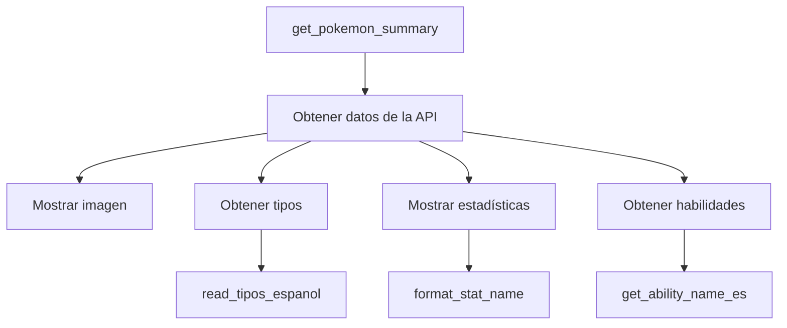

# Pokémon API

Este proyecto es una implementación en Python que utiliza la [PokéAPI](https://pokeapi.co/) para obtener información detallada sobre Pokémon, incluyendo sus estadísticas, tipos, habilidades e imágenes. La información se presenta en español para mejor comprensión.

## Requisitos de Instalación

```bash
pip install requests
pip install IPython
```

## Configuración

### Archivo tipos_espanol.txt

El proyecto requiere un archivo `tipos_espanol.txt` que contiene las traducciones de los tipos de Pokémon del inglés al español. El archivo debe estar en el mismo directorio que el notebook y tener el siguiente formato:

```text
bug Bicho
dark Siniestro
dragon Dragón
electric Eléctrico
fairy Hada
fighting Lucha
fire Fuego
flying Volador
ghost Fantasma
grass Planta
ground Tierra
ice Hielo
normal Normal
poison Veneno
psychic Psíquico
rock Roca
steel Acero
water Agua
```

## Funcionalidades

El proyecto incluye las siguientes funciones principales:

### `read_tipos_espanol(file_path)`
- Lee el archivo de traducciones y crea un diccionario de mapeo inglés-español
- Parámetros:
  - `file_path`: Ruta al archivo tipos_espanol.txt

### `get_ability_name_es(ability_url)`
- Obtiene el nombre de una habilidad en español
- Parámetros:
  - `ability_url`: URL de la habilidad en la PokéAPI

### `format_stat_name(stat_name)`
- Formatea el nombre de las estadísticas en español
- Parámetros:
  - `stat_name`: Nombre de la estadística en inglés

### `get_pokemon_summary(pokemon_name)`
- Función principal que muestra toda la información de un Pokémon
- Parámetros:
  - `pokemon_name`: Nombre del Pokémon en inglés
- Muestra:
  - Imagen del Pokémon
  - Tipo(s)
  - Estadísticas base
  - Habilidades con descripciones

## Ejemplos de Uso

```python
# Obtener información completa de un Pokémon
get_pokemon_summary('volcarona')
```

Este comando mostrará:
- Una imagen de Volcarona
- Sus tipos (Bicho/Fuego)
- Estadísticas base (HP, Ataque, Defensa, etc.)
- Habilidades con sus descripciones en español

## Estructura del Código



## Notas Importantes

- Todas las consultas se realizan a través de la API pública de PokéAPI
- Las imágenes se muestran directamente desde los servidores de PokéAPI
- Las traducciones de tipos están limitadas a las incluidas en el archivo tipos_espanol.txt
- Se requiere conexión a internet para obtener los datos

## Licencia

Este proyecto incluye una licencia que puedes consultar en el archivo `LICENSE`.